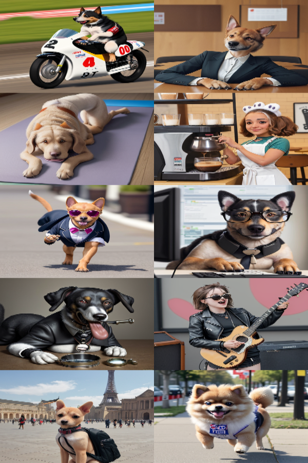

# Dashtoon-Product-Engineer
Develop a simple web application that allows users to create and share a 10-panel comic strip. The comic is generated by inputting text into a form, which is then sent to a text-to-image API using a provided API key.

## Steps to generate strip:
1. Enter context for the image in 'Home' section.
2. Generate 10 images. The strip accomodate 10 panels in the order of image generated.
3. Move to Strip section and click on 'Add Generated Images' button.
4. To download the strip click on 'Download Comic' button.

## Improvements:
1. Drag and resize feature can be added in the canvas section. It would help user to arrange the images as per convenience.Due to limited time couldn't add this functionality. It has a lot of edge cases :smiling_face_with_tear:
2. With drag and resize feature in canvas, the speech bubbles and text annotations on the images could be added with ease.

## Sample Output:
